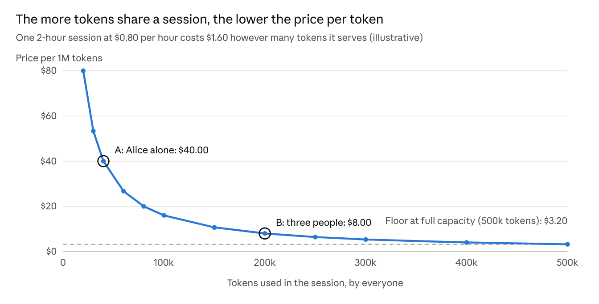

# AI lab monitoring spec

What the lab should measure, why, where each signal comes from, and what has to be built to get it
into Grafana Cloud (https://olivesycamore976.grafana.net). This is the plan for the Grafana work; the
current telemetry setup is in [grafana-telemetry.md](../grafana-telemetry.md).

Status: ==draft==; the usage data on the instance (issue #76) is built, see "Built so far". Items marked **today** already reach Grafana; everything else is a gap
with the collection method proposed below.

## Goals

1. **Prove the AI works during a demo:** tool calls happen, they succeed, and answers come from data.
2. **Quantify the tokenomics:** tokens in and out, speed, and what each token, chat and user costs.
3. **Troubleshoot fast:** when a chat is slow or wrong, find out whether it is the model, the GPU, the
   tools, Open WebUI or the network, from one place.
4. **Control cost:** see what the lab costs while running and idle, and that auto-stop works.

Non-goals: storing prompts or answers, per-person productivity tracking, long-term compliance archive.

## Where the data lives today

| Grafana data source | Fed by | Contains today |
|---|---|---|
| `grafanacloud-olivesycamore976-prom` | Alloy on the instance | Host metrics (`node_*`), systemd unit state, Open WebUI OTel metrics (`http.server.*`, `webui.users.*`) |
| `grafanacloud-olivesycamore976-logs` | Alloy on the instance | Bootstrap log, Ollama/Docker/Alloy journal, container logs (redacted) |
| `grafanacloud-olivesycamore976-traces` | Open WebUI OTel | Request traces for service `open-webui` |
| CloudWatch (not connected) | AWS | Lambda `tool_call` log lines, Lambda and ALB metrics, EC2 state |

The biggest gaps: tool calls are only in CloudWatch, tokens are only in Open WebUI's database, and
nothing reads the GPU.

## Signals

### 1. Tool calls (MCP)

| Signal | Why | Source | Collection |
|---|---|---|---|
| Calls per tool over time | Shows the model is using the tools, and which | Lambda `tool_call` JSON lines | Grafana CloudWatch data source, Logs Insights query |
| Success and error rate per tool (`ok`) | A failing tool looks like a bad answer | same | same |
| Tool latency p50 / p95 | Slow tools make slow chats | same (`ms` field) | same |
| Result size | Big results eat the context window | same (size field) | same |
| Calls refused with 401 | Wrong token or someone probing the URL | Lambda log | same, plus an alert |
| Chats on Security Analyst with no tool call | The failure we chased: the model answered from memory | Open WebUI messages vs tool-call rows | exporter (see Collection), ratio panel |
| Lambda invocations, errors, throttles, duration | Server-side health | CloudWatch metrics `AWS/Lambda` | CloudWatch data source |

### 2. Temperature

"Temperature" means two different things here; both are covered.

**Sampling temperature (model setting).**

| Signal | Why | Source | Collection |
|---|---|---|---|
| Configured temperature, top_p, top_k per model | Explains how deterministic answers are; low values help tool use | Open WebUI model params (Security Analyst: 0.6 / 0.95 / 20) | exporter reads `/api/v1/models`, publishes `ai_lab_model_param{model,param}` |
| Context length (`OLLAMA_CONTEXT_LENGTH`) and function calling mode | Context too small silently drops tool definitions | settings file, model params | exporter |
| Per-chat overrides | A user can change temperature in chat controls | chat params in Open WebUI DB | exporter counts chats with an override (no content) |

Per-request temperature is not logged by Ollama or Open WebUI, so the dashboard shows the configured
value and how many chats overrode it, not a per-message value.

**Hardware temperature (GPU).**

| Signal | Why | Source | Collection |
|---|---|---|---|
| GPU temperature (°C) | Thermal throttling slows generation | `nvidia-smi` | exporter writes `ai_lab_gpu_temperature_celsius` |
| Throttle reasons active | Confirms throttling, power or thermal | `nvidia-smi --query-gpu=clocks_throttle_reasons.active` | `ai_lab_gpu_throttled` |
| Power draw vs limit (W) | Load indicator and throttle cause | `nvidia-smi` | `ai_lab_gpu_power_watts`, `ai_lab_gpu_power_limit_watts` |
| GPU utilization, memory used and total | Whether the GPU is busy and the model fits | `nvidia-smi` | `ai_lab_gpu_utilization_ratio`, `ai_lab_gpu_memory_used_bytes`, `..._total_bytes` |

### 3. Tokenomics

| Signal | Why | Source | Collection |
|---|---|---|---|
| Input and output tokens by model | Volume of work | Open WebUI `GET /api/v1/analytics/tokens` | exporter, `ai_lab_tokens_total{model,direction}` |
| Tokens and cost by user | Who uses the lab and their share of the cost | `GET /api/v1/analytics/users` | **control panel admin page**, not Grafana (see Cost allocation) |
| Messages and chats per day | Adoption | `GET /api/v1/analytics/daily`, `/summary` | exporter |
| Generation speed (output tokens/s) | The headline model-performance number | Ollama `eval_count / eval_duration`, kept by Open WebUI in message usage | exporter from `/api/v1/analytics/messages` (to verify on v0.11.4) |
| Prompt processing speed and time to first token | How long users wait before text appears | Ollama `prompt_eval_*`, Open WebUI traces | exporter; trace span duration |
| Model load time | Cold-start cost after idle | Ollama `load_duration` | exporter |
| Context fill (prompt tokens / context length) | Near 100% means truncation and lost tool definitions | tokens and settings | Grafana expression |
| Instance cost per hour | The cost basis | `ai_lab_instance_hourly_cost_usd` set from tfvars (g6.xlarge about $0.80 on demand) | exporter constant |
| Cost per 1M tokens and per chat, per session | The tokenomics answer | session cost ÷ session tokens (see Cost allocation) | Grafana expressions; per-user split on the admin page |
| Capacity utilization per session | Why a session's price per token was high | tokens used ÷ (tokens/s × running seconds) | exporter and Grafana expression |
| Idle cost share | Money spent while no one chats | running hours vs hours with requests | Grafana expression |
| Equivalent hosted-API cost (optional) | "What would this cost on a hosted model" | tokens × a price you enter | dashboard variable, never hard-coded |

### 4. Model serving (Ollama)

| Signal | Why | Source | Collection |
|---|---|---|---|
| Model loaded, size, and VRAM vs CPU split | A model that spills to CPU is many times slower | `GET /api/ps` (`size`, `size_vram`) | exporter, `ai_lab_ollama_model_vram_ratio{model}` |
| Requests, latency, status | Serving health | Ollama journal (GIN lines) | today (logs); LogQL panels |
| Concurrent requests / queueing | Many users at once on one GPU | Ollama journal, Open WebUI traces | LogQL and traces |
| Ollama service up | Basic health | systemd unit state | **today** |

### 5. Open WebUI

| Signal | Why | Source | Collection |
|---|---|---|---|
| Request rate, latency, 5xx by route | App health | OTel `http.server.requests`, `http.server.duration` | **today** |
| Active users now and today, total users | Usage | OTel `webui.users.*` | **today** |
| Traces of a chat request | Where the time went (model vs tool vs DB) | OTel traces | **today**; saved TraceQL query |
| Sign-ins and failed sign-ins | Access and abuse | container logs | **today** (logs); LogQL panel |
| Message ratings (thumbs up/down) | Answer quality as users see it | Open WebUI evaluations | exporter, `ai_lab_feedback{rating}` (per rating; per model needs the message fields, issue 12) |

### 6. Host and lab lifecycle

| Signal | Why | Source | Collection |
|---|---|---|---|
| CPU, memory, disk, network | Capacity; model files and images fill the disk | `node_*` | **today** |
| Bootstrap result and duration | Deploy health | bootstrap log | **today** (logs) |
| Instance running hours, starts and stops | Cost and auto-stop proof | EC2 state, auto-stop logs | CloudWatch data source; journal |
| Idle timer and hard-limit remaining | Will it stop during the demo? | `ai-lab-idle-check` | exporter |
| ALB healthy targets, 5xx, latency | Edge health | CloudWatch `AWS/ApplicationELB` | CloudWatch data source |

## Cost allocation

Decided: cost is charged **per run session**. A session is one run of the instance, from start to
stop. The lab's cost is a fixed price per running hour, so each session has a known cost, and the
people who used that session share it.

- **Session cost** = instance price per hour × the session's running hours (boot to stop).
- **Session cost per token** = session cost ÷ all tokens used in that session.
- **A user's charge** = session cost × that user's share of the session's tokens.
- **Worked out hour by hour.** Each hour of a session is shared among the people who used tokens in
  that hour, and a user's session charge is the sum of their hours. This adds up to the same session
  cost, but nobody pays for hours after they stopped using the lab, which spend caps rely on. An hour
  with no tokens (start-up before the first chat, the idle tail before auto-stop) goes to whoever
  used tokens in the nearest hour before it, or after it for start-up: they are the ones who kept the
  lab running.
- **The price per token is set by how busy the session was.** One user alone carries 100% and pays
  the highest price per token. When others join the same session, the same cost is spread over more
  tokens and everyone's price per token falls. A user pays more in a quiet session than in a busy
  one for the same work, because the lab ran below the capacity that makes it economical. This is
  shown, not hidden.
- **Final only at stop.** During a session the page shows the cost so far and a running price per
  token; both are final when the instance stops.
- **Capacity utilization** per session = tokens used ÷ tokens the GPU could have produced in the
  same hours (measured tokens per second × running seconds). It explains a high price per token:
  "this session ran at 4% of capacity".
- **Cost at full use**, the session cost ÷ that capacity, is the floor price per token for this
  instance type, for comparing sessions and instance types.
- **Sessions with no tokens** (started, never chatted) are charged to whoever started the instance,
  from the control panel's start log; if that is unknown they are listed as unallocated.
- **Idle time inside a session** is bounded by auto-stop: the lab stops after
  `auto_stop_idle_minutes` without use, so a session is use plus one idle tail. Startup, model load
  and the idle tail are shown as parts of the session cost.
- **Awake without tokens:** the idle monitor counts a user as active when Open WebUI saw them in the
  last 3 minutes, so an open, unused tab keeps the lab running while spending no tokens. The admin
  page shows active minutes per user next to tokens so this is visible.
- **Scale limit:** the price per token falls only until the GPU is saturated; past that, answers slow
  down and the next step is a larger or second instance, a step up in session cost.
- **Weighting (decided):** shares are by total tokens, input plus output. Output tokens cost far more GPU
  time than input tokens, so by GPU time would be fairer, but Open WebUI's usage API gives token counts
  only, not GPU time per request, and the page has to explain every charge from numbers people can see.
  Revisit if the usage API starts reporting generation time.

Data needed: session start and stop times (a session log the instance keeps on its disk, checked
against EC2 state changes), tokens per message with user and time (Open WebUI usage API), and the
instance's measured tokens per second.

The per-user view is an **admin page in the control panel**, not a Grafana dashboard: users are named
there, behind the panel's admin sign-in, and no per-user data is sent to Grafana. It lists sessions
(start, stop, hours, cost, tokens, price per token, capacity utilization) and, per session, each
user's tokens, share, charge and active minutes, with totals per user over a chosen date range.

## Spend caps

Decided: spend is capped in dollars, not tokens, at two levels, and both caps are set and watched in
the **control panel** (**Spend caps** page):

| Cap | Limits | Emails at 50%, 80%, 98% go to | At 100% |
| --- | --- | --- | --- |
| **Lab total** | The lab's real running cost this month (instance price × hours run) | The admins | The instance is stopped and the panel's Start button is disabled until the cap is raised or the month resets |
| **Per user** | The user's allocated cost this month (Cost allocation) | The user (admins copied at 100%) | The user cannot sign in until the month resets; the lab keeps running for others |

The page shows each cap, the spend so far, the percentage, the projected month-end spend at the
current rate, which emails were sent, and who is blocked. Changes to a cap are written to the
panel's change log.

| Panel role | Lab total cap | Per-user caps |
| --- | --- | --- |
| `admin` | Read and change | Read and change, for every user |
| `user_mgrs` | Read | Read only, for every user: each user's cap, spend, block state and every cap email sent to them |
| `operators` | — | Read their own cap, spend and emails |

### Per-user cap

- **Cap and period.** A dollar amount per user per calendar month, set on the Spend caps page by an
  admin; a default cap for everyone, with per-user overrides. No cap means unlimited. The period is the
  calendar month (UTC) because AWS bills by calendar month; it resets on the 1st, and blocked users are
  let back in then.
- **What counts.** Charges are worked out per **hour within a session**: a user pays a share only of
  the hours in which they used tokens. This keeps the session model's fairness, and it means a
  user's spend stops growing soon after they stop using the lab: at most the idle tail before
  auto-stop can still be added. Completed hours are final; the current hour is provisional.
- **Checked against.** Final charges this period + the provisional charge for the current hour,
  every 5 minutes while the lab runs.
- **Emails.** One email per threshold per period, never repeated: 50% (heads-up), 80% (plan ahead),
  98% (about to be stopped), and one when stopped at 100%. Each says the cap, the spend so far and the
  reset date. The admin gets a copy of the 100% email. Emails go to the address on the user's identity
  in the identity provider (Cognito `email`), never an address typed elsewhere.
- **Email confirmation.** Decided: Amazon SNS, not SES, and only to verified identities. Before a user
  can be emailed, their identity must have a verified address (the Cognito user's `email_verified` is
  true for the same `email`); anyone else is marked `unverified` and never emailed. For a verified
  user the spend job subscribes their address to one SNS topic with a filter policy on a `recipient`
  message attribute, so only they receive messages published for them. SNS sends one confirmation
  email with a link. The result is on the user's row: `unconfirmed`, `unverified`, `pending`,
  `confirmed`, `failed`, `expired` (link not clicked within 48 hours) or `unsubscribed` (they used the
  link in an email). The admin page shows the status and can send again. Caps are enforced either way;
  only the emails wait for confirmation, and the page warns about capped users whose address is not
  confirmed.
- **At 100%.** The user is **blocked from signing in** until the month resets:
    - Their account is disabled in the identity provider (the lab's Cognito pool), so they cannot sign
      in to Open WebUI or the control panel.
    - In the same step their Open WebUI role is set to `pending`, which ends a session they already
      have open. A disabled identity alone does not end an Open WebUI session, which can last weeks.
  On the 1st the account is enabled and the previous role restored. An admin can also lift a
  block early by raising the user's cap above their spend; the account and role are
  restored at once. Every block and unblock, and who made it, is in the change log.
- **Shown in the control panel.** Users with the `admin` or `user_mgrs` role see a **Blocked: spend
  cap** badge on the user, with the reason, the cap, the spend, the date blocked and the date it lifts
  ("Blocked for the rest of October: monthly AI spend cap of $5.00 reached on Oct 24; sign-in returns
  Nov 1"). When a blocked user asks why they cannot sign in, the person they ask can answer from that
  page. The 100% email to the user says the same, so the user knows before they try.
- **Overrun.** Because the check runs every 5 minutes and the current hour is provisional, the final
  spend can pass the cap slightly. The 98% warning and the admin page show the final figure; nothing is
  hidden.
- **Admins** are exempt from being blocked (so someone can always raise a cap) but still get the
  emails. User managers can be capped like anyone else, and only an admin can raise their cap.

### Lab total cap

- **Spend** = instance price per hour × hours the instance ran this month, from the session log, so it
  is current to the minute (AWS billing data lags by a day, so it is used only to reconcile).
- **Checked** every 5 minutes by the same scheduled job, and before every start from the panel: a start
  is refused when the cap is reached, and warned about when the remaining budget is under one hour.
- **At 100%** the instance is stopped through the panel's normal stop path, the Start button shows
  "Monthly budget reached", and the admins get an email. An admin can raise the cap or let the
  lab run **once** past it: **Allow one run past the cap** on the Spend caps page. That allows the next
  start (or the run in progress), leaves the cap unchanged, is recorded in the access changes history,
  and ends when the lab next stops, when the cap is raised, or when the month changes.
- **Relation to the per-user caps:** the lab cap limits the real bill; the user caps limit each
  person's share of it. The page shows the user caps' total next to the lab cap, so the admin can see
  which one will stop people first.
- **Relation to auto-stop:** idle shutdown and the hard time limit still apply; the lab cap is the
  monthly backstop above them.

Implementation outline (control panel API stack): the caps and the period's sent-threshold flags live
in the panel's tables (the lab cap with the lab's settings, user caps on each user's row). A scheduled
Lambda (every 5 minutes) reads the session's hourly usage from the instance through the existing
Systems Manager channel, updates each user's spend and the lab's, sends emails through an Amazon SNS topic
(one filtered subscription per verified person), changes the Open WebUI role through the same channel, and stops the instance when the lab
cap is reached. Every check, email and block is written to the control panel's change log.

## What else is worth adding

These were not in the original ask but pay off for this lab:

- **Tool-use ratio on Security Analyst**: share of its answers that included a tool call. One number
  that says "the integration works".
- **Context fill**: the most likely silent failure with 14B models and several MCP servers.
- **VRAM vs CPU split**: the most likely cause of "it got slow".
- **Time to first token**: what users actually feel, more than total latency.
- **Answer feedback**: thumbs up/down per model, so model changes can be compared.
- **Cold starts**: model load time after the instance starts or the model is unloaded.
- **Cost per user and idle cost share**: the two numbers a budget owner asks for.
- **Security events**: MCP 401s, failed sign-ins, admin changes in the control panel.

## Dashboards

| Dashboard | Audience | Panels |
|---|---|---|
| **Lab overview** | Demo, at a glance | Up/down of instance, Ollama, Open WebUI, Alloy; active users; chats today; tool calls today and error rate; GPU temp and utilization; cost so far today |
| **Tool calls** | Demo proof, MCP debugging | Calls per tool, errors, p95 latency, result size, 401s, tool-use ratio, latest calls table |
| **Tokenomics** | Budget, model comparison | Tokens in/out by model and over time, tokens/s, time to first token, context fill, total cost, cost per 1M tokens and per chat, idle share, optional hosted-API comparison |
| **Model serving and GPU** | Troubleshooting | Loaded model and VRAM split, GPU temp/power/throttle/memory/utilization, Ollama latency, load time, configured temperature and context |
| **Logs** | Troubleshooting | Saved LogQL queries: bootstrap warnings, registration lines, Ollama errors, Open WebUI errors, sign-ins |

Dashboards are kept as JSON in the repository and imported into Grafana; the control panel links to
them. Per-user tokens and cost are on the control panel's admin **Usage and cost** page instead.

## Alerts (few, demo-relevant)

| Alert | Condition |
|---|---|
| GPU hot | GPU temperature above 85 °C for 5 minutes, or a thermal throttle reason active |
| Model on CPU | Loaded model with less than 100% in VRAM |
| Tool errors | Tool error rate above 10% over 15 minutes |
| MCP refusals | More than 5 `401` responses in 10 minutes |
| Disk filling | Root disk above 85% |
| Open WebUI errors | 5xx rate above 5% over 5 minutes |
| Telemetry silent | No metrics from the lab for 10 minutes while the instance is running |

## Collection plan

1. **`ai-lab-metrics` exporter** on the instance: a small script on a 30-second systemd timer that
   reads `nvidia-smi`, Ollama `/api/ps`, the Open WebUI analytics and models APIs (admin session, as the
   registration script does) and the idle-check state, and writes Prometheus text to
   `/var/lib/ai-lab/metrics/ai_lab.prom`. Delivered from the lab-assets S3 bucket like the other
   scripts. No prompt or answer text is read.
2. **Alloy**: enable the `textfile` collector on that directory. No new ports or credentials.
3. **Grafana CloudWatch data source** with a read-only IAM role for Grafana Cloud, for Lambda tool-call
   logs, Lambda, ALB and EC2 metrics. Avoids shipping the Lambda logs a second time.
4. **Dashboards and alerts** as JSON under `grafana/`, imported by hand first; Terraform-managed later
   if useful.
5. **Panel link**: the control panel sidebar opens the Lab overview dashboard.

## Built so far (issue #76)

The usage data on the instance is written and tested offline; it has not run on a real lab yet
(waiting on the GPU quota), so Open WebUI's analytics responses are checked at the first deploy.

| Piece | Where | What it does |
|---|---|---|
| Session log | `scripts/ai-lab-session-log`, units `ai-lab-session-log.service` and `ai-lab-session-heartbeat.timer` | Start and stop time of each run in `/var/lib/ai-lab/sessions.jsonl`. A run that ended without a stop (power loss) is closed at its last heartbeat and marked `lost`. |
| Hourly usage | `scripts/ai-lab-usage`, timer `ai-lab-usage-collect.timer` (at :05) and `ai-lab-usage-final.service` (at shutdown, before Docker stops) | Per finished hour, tokens and messages per user and per model from Open WebUI's `GET /api/v1/analytics/users` and `/tokens` with `start_date`/`end_date`, kept in `/var/lib/ai-lab/usage.jsonl`. Re-collecting an hour replaces it. A response of an unexpected shape stores nothing. |
| Control panel channel | `usage` action of the panel's SSM document (`dashboards/api/webui-admin.sh`) | Returns the recorded hours, the sessions and the hour in progress (marked provisional) as one JSON line, under SSM's 24,000-character limit (oldest hours are dropped and `truncated` says so). `POST /admin/webui/actions` with `{"action": "usage", "sinceHour": <epoch>}`. |
| Metrics | `scripts/ai-lab-metrics`, `ai-lab-metrics.timer` (30 s) | Writes the `ai_lab_` metrics below to `/var/lib/ai-lab/metrics/ai_lab.prom`; Alloy's `textfile` collector sends them. |
| Price | `instance_hourly_cost_usd` in `terraform.tfvars` | Becomes `ai_lab_instance_hourly_cost_usd` and the price the usage page uses. |

Also built, offline only: the control panel pages for Open WebUI status, Usage and cost, Spend caps,
Timer policy and the Chat API test, and the spend caps job (`dashboards/api/spend_job.py`, every five
minutes) with the cost split in `dashboards/api/costing.py`. Nothing here has run against a real
Open WebUI v0.11.4, Cognito or Amazon SES yet; see the control panel smoke tests.

Grafana and log search, also offline only (nothing has run against a real Grafana Cloud stack):

| Piece | Where | What it does |
|---|---|---|
| Dashboards and alerts | `grafana/generate.py` writes `grafana/dashboards/*.json` and `grafana/alerts/alert-rules.json` | The five dashboards and seven alert rules above. `tests/test_grafana_dashboards.py` checks that every metric exists, the layout does not overlap and the committed JSON matches the generator. |
| Import | `scripts/import-grafana.ps1` | Loads them through Grafana's HTTP API with a service account token; safe to run again. |
| CloudWatch access | `grafana_cloudwatch.tf` | Read-only role that Grafana's CloudWatch data source assumes. Needs Grafana's account ID and external ID, so it is two steps. |
| Tool-call metrics | `aws_cloudwatch_log_metric_filter.vuln_mcp` in `vuln_mcp.tf` | Turns the MCP Lambda's JSON log lines into `AILab/Tools` calls, errors, latency and refusals, so panels and alerts do not need Logs queries. |
| Panel link | `grafana_dashboard_url` | Administrators-only **Grafana** link in the control panel sidebar. |
| Log tools | `lambda/vuln_mcp/log_tools.py` | Five read-only tools over Loki for the Security Analyst. |

Decision, log store for the Security Analyst: Grafana Cloud Loki. Splunk needs a licence or an
Enterprise trial and its own server; OpenSearch, Graylog and Wazuh each need a server (and a second
shipping path from the instance) that the lab would have to run and pay for. Loki already receives
the bootstrap log, the journal and the container logs through Alloy, is open source, and has a free
tier. The tools sit behind a two-method backend class, so another store can replace it later.

Built from sources that need no guessing at Open WebUI's message fields: Ollama's journal (chat
requests in the last 5 minutes by status class, their average and longest time, and the last model
load time) and a read-only look at Open WebUI's database (the number of chats, and answers rated up
and down; no titles or text). Each has its own `ai_lab_exporter_source_up` value, so one failing
leaves the rest. Request time is the whole request, not the time to the first token.

Not built yet: time to first token and generation speed (tokens per second). They need per-message
timing fields that Open WebUI v0.11.4 has to be checked for. Run `sudo ai-lab-metrics --shapes` on the
instance at first deploy; it prints the keys and types (never values) of the analytics answers and the
`chat`, `feedback` and `message` tables, and the exporter is then written against what it shows
(issue 12 in `issues-usage-caps-grafana.md`). Feedback is counted per rating only, not per model, and
assumes `feedback.data.rating` is positive for a thumbs up and negative for a thumbs down.

One thing to know: Open WebUI marks a user active on every API request, and the idle monitor
treats an active user as a reason to keep the lab running. Scripts that call the API as the admin
(`scripts/ai-lab-webui-lib.sh`) put the admin's `last_active_at` back after each run, so polling
never keeps the lab awake.

## Metric names

All lab-specific metrics use the `ai_lab_` prefix and carry `instance_id`.

| Metric | Type | Labels |
|---|---|---|
| `ai_lab_gpu_temperature_celsius` | gauge | `gpu` |
| `ai_lab_gpu_utilization_ratio` | gauge | `gpu` |
| `ai_lab_gpu_memory_used_bytes`, `ai_lab_gpu_memory_total_bytes` | gauge | `gpu` |
| `ai_lab_gpu_power_watts`, `ai_lab_gpu_power_limit_watts` | gauge | `gpu` |
| `ai_lab_gpu_throttled` | gauge (0/1) | `gpu`, `reason` |
| `ai_lab_ollama_model_loaded` | gauge (0/1) | `model` |
| `ai_lab_ollama_model_size_bytes`, `ai_lab_ollama_model_vram_ratio` | gauge | `model` |
| `ai_lab_model_param` | gauge | `model`, `param` (temperature, top_p, top_k, num_ctx) |
| `ai_lab_tokens_total` | counter | `model`, `direction` (input, output) |
| `ai_lab_messages_total` | counter | `model` |
| `ai_lab_chats` | gauge | |
| `ai_lab_feedback` | gauge | `rating` (up, down) |
| `ai_lab_ollama_chat_requests_5m` | gauge | `status` (2xx, 4xx, 5xx) |
| `ai_lab_ollama_chat_request_seconds_avg_5m`, `ai_lab_ollama_chat_request_seconds_max_5m` | gauge | |
| `ai_lab_ollama_last_model_load_seconds` | gauge | |
| `ai_lab_instance_hourly_cost_usd` | gauge | `instance_type` |
| `ai_lab_idle_seconds_remaining`, `ai_lab_hard_limit_seconds_remaining` | gauge | |
| `ai_lab_exporter_source_up` | gauge (0/1) | `source` (gpu, ollama, open_webui, ollama_log, webui_db) |
| `ai_lab_exporter_last_success_timestamp_seconds` | gauge | |

## Privacy

- No prompt or answer text in metrics, labels or new log lines.
- No per-user data in Grafana. Per-user tokens and cost are only on the control panel admin page.
- Labels are bounded (models, tools, GPUs), so cardinality stays small.

## Open questions

- Which hourly price to use: on-demand list price, or a value you enter for savings plans?
- Should the optional hosted-API comparison be on the Tokenomics dashboard for the demo?
